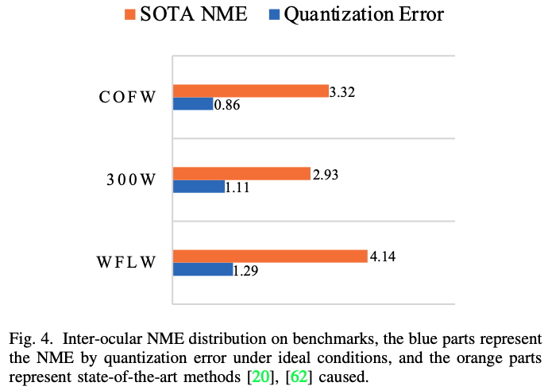
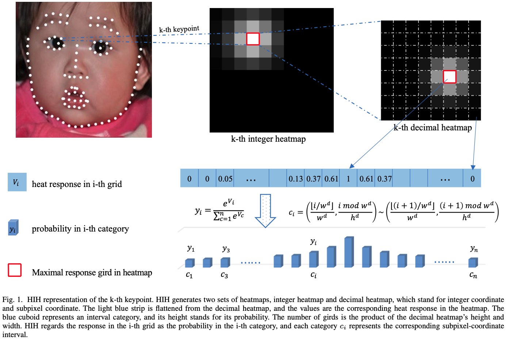
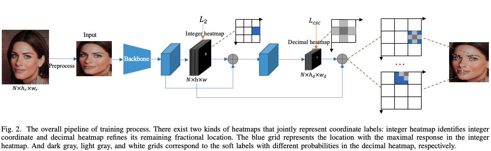
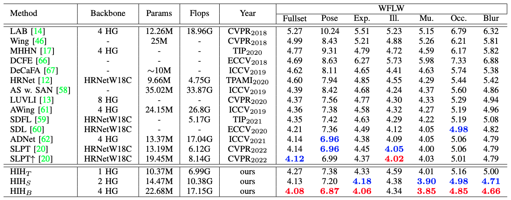
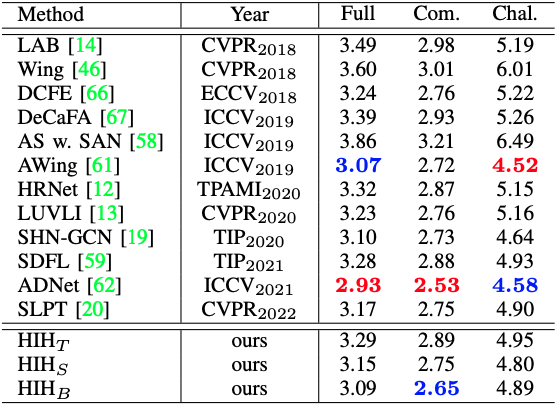

# HeatmapInHeatmap
[](https://paperswithcode.com/sota/face-alignment-on-wflw?p=hih-towards-more-accurate-face-alignment-via)
[](https://paperswithcode.com/sota/face-alignment-on-cofw?p=hih-towards-more-accurate-face-alignment-via)
[](https://paperswithcode.com/sota/face-alignment-on-300w?p=hih-towards-more-accurate-face-alignment-via)

For models not using extra training data, HIH has got: 
* <strong>Rank 1</strong> on [WFLW Leaderboard](https://paperswithcode.com/sota/face-alignment-on-wflw) 
* **Rank 1** on [COFW Leaderboard](https://paperswithcode.com/sota/face-alignment-on-cofw) 
* **Rank 3** on [300W Leaderboard](https://paperswithcode.com/sota/face-alignment-on-300w).

Arxiv:[HIH:Towards More Accurate Face Alignment via Heatmap in Heatmap](https://arxiv.org/abs/2104.03100) 

ICCVW:[Revisting Quantization Error in Face Alignment](https://openaccess.thecvf.com/content/ICCV2021W/MFR/papers/Lan_Revisting_Quantization_Error_in_Face_Alignment_ICCVW_2021_paper.pdf)


<!-- It is the Pytorch Implementation of HIH:Towards More Accurate Face Alignment via Heatmap in Heatmap. -->

## News

* [ April 18, 2022 ] We released HIH v2 in arxiv.

* [ April 17, 2022 ] Pretrained Model and evaluation code on WFLW dataset are released.

* [ March 22, 2022 ] HIH breaks the new records on WFLW and COFW.

* [ August 13, 2021 ] Accept by ICCV Workshop (Masked Face Recognition Challenge)

* [ April 03, 2021 ] We released HIH v1 in arxiv.

## Introduction

This is the official code of HIH:Towards More Accurate Face Alignment via Heatmap in Heatmap. 
Compared with ICCVW version, we transform the subpixel regression problem into an interval classification problem and design a seamless loss to further improve performance. 
Moreover, we also adapt standard 4-stacked hourglass for experiments. 
We evaluate our methods on three datasets, COFW, WFLW and 300W.

<center></center>





## Results

For inter-ocular NME, HIH reaches <strong>4.08</strong> on WFLW, <strong>3.21</strong> on COFW, 3.09 on 300W.

### WFLW
<center>  </center>

### COFW
<center>  </center>

### 300W
<center>  </center>

## Installation

* Install Packages: ```pip install -r requirements.txt``` 

* We have processed the dataset following [PFLD](https://github.com/guoqiangqi/PFLD) practice, and you can download the training data and checkpoint directly at [Baidu Drive](https://pan.baidu.com/s/1QESuPhP9d6TUVySNBqQcZw) (passwd:cjap) or [Google Drive](https://drive.google.com/drive/folders/1leozJAlv1qiJ29PnJkpxjv1OINd-D3U7?usp=sharing)

* Unzip and move files into ```Best/WFLW``` and ```data/benchmark``` directory. Your folder structure should look like this

        ```
        HeatmapInHeatmap
        └───data
           │
           └───benchmark
           │   └───WFLW
           │   │
           │   └───COFW
           │   │     
           │   └───300W
        └───Best
           │
           └───WFLW
           │   └───WFLW.pth
           └───COFW
           │   └───COFW.pth
           └───300W
           │   └───300W.pth
        ```


## Run Evaluation on WFLW

Evaluation cmd:

    python tools/test_all.py --config_file experiments/Data_WFLW/HIHC_64x8_hg_l2.py --resume_checkpoint Best/WFLW/WFLW.pth

## Future Plans
- [x] Release evaluation code and pretrained model on WFLW dataset.

- [ ] Release training code on WFLW dataset.
 
- [ ] Release pretrained model and code on 300W and COFW dataset.

- [ ] Release facial landmark detection API

## Citations
If you find this work or code is helpful in your research, please cite the following papers.

```
@inproceedings{DBLP:conf/iccvw/LanHC21,
  author    = {Xing Lan and
               Qinghao Hu and
               Jian Cheng},
  title     = {Revisting Quantization Error in Face Alignment},
  booktitle = {{IEEE/CVF} International Conference on Computer Vision Workshops,
               {ICCVW} 2021, Montreal, BC, Canada, October 11-17, 2021},
  pages     = {1521--1530},
  publisher = {{IEEE}},
  year      = {2021},
  url       = {https://doi.org/10.1109/ICCVW54120.2021.00177},
  doi       = {10.1109/ICCVW54120.2021.00177},
  timestamp = {Wed, 06 Apr 2022 11:41:39 +0200},
  biburl    = {https://dblp.org/rec/conf/iccvw/LanHC21.bib},
  bibsource = {dblp computer science bibliography, https://dblp.org}
}

@article{DBLP:journals/corr/abs-2104-03100,
  author    = {Xing Lan and
               Qinghao Hu and
               Jian Cheng},
  title     = {{HIH:} Towards More Accurate Face Alignment via Heatmap in Heatmap},
  journal   = {CoRR},
  volume    = {abs/2104.03100},
  year      = {2021},
  url       = {https://arxiv.org/abs/2104.03100},
  eprinttype = {arXiv},
  eprint    = {2104.03100},
  timestamp = {Wed, 06 Apr 2022 11:41:43 +0200},
  biburl    = {https://dblp.org/rec/journals/corr/abs-2104-03100.bib},
  bibsource = {dblp computer science bibliography, https://dblp.org}
}
```

## Acknowledgments
This repository borrows or partially modifies hourglass model and data processing code from [Hourglass](https://github.com/raymon-tian/hourglass-facekeypoints-detection) and [HRNet](https://github.com/HRNet/HRNet-Facial-Landmark-Detection)

## License
This repository is released under the Apache 2.0 license.


